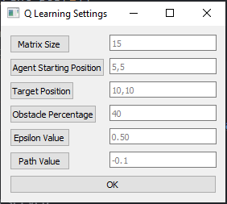
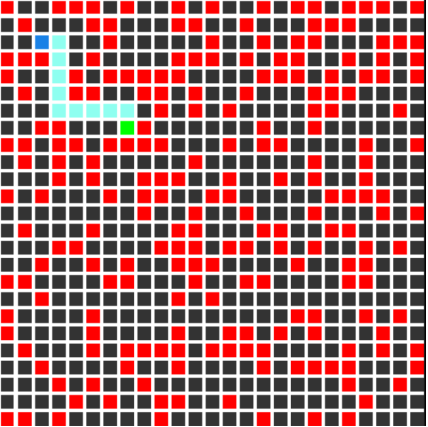
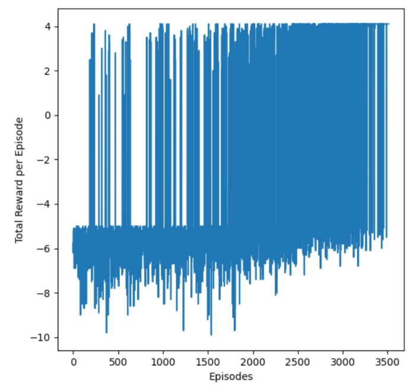
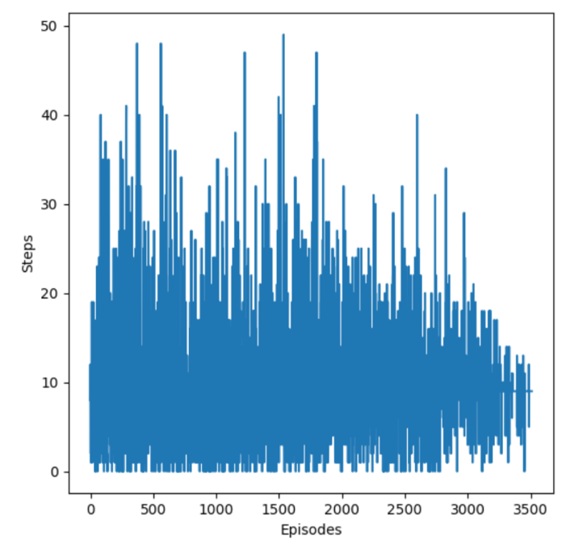

= Path Planning via Q-Learning

Q-learning is a values-based learning algorithm. Value based algorithms updates the value function based on an equation(particularly Bellman equation). Whereas the other type, policy-based estimates the value function with a greedy policy obtained from the last policy improvement.

Q-learning is an off-policy learner. This means it learns the value of the optimal policy independently of the agent’s actions. On the other hand, an on-policy learner learns the value of the policy being carried out by the agent, including the exploration steps and it will find a policy that is optimal, taking into account the exploration inherent in the policy.

== Used Q Function
Q(s,a) = r(s,a)+ max(Q(s',a')γ

== Epsilon Greedy Strategy 
The agent will explore the environment and randomly choose actions. This occurs logically since the agent does not know anything about the environment. As the agent explores the environment, the epsilon rate decreases and the agent starts to exploit the environment.

During the process of exploration, the agent progressively becomes more confident in estimating the Q-values.

== Settings Screen

Completely customizable, and it will start with default values in case you don't enter any custom value.

== Result

== Libraries

* Settings screen: PyQt5 
* Maze and Agents visualization: pygame
* Q-Table and Maze values: numpy
* To boost execution speed: numba
* Result plots: matplotlib

